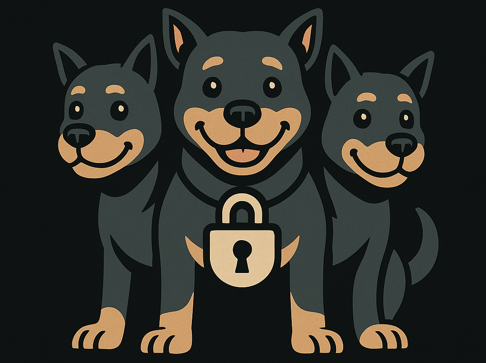

  

<h1 align="center">cerberus</h1>

<i>Your first line of defense against low-quality documents in RAG systems.</i>

cerberus is a lightweight pipeline for filtering, normalizing and ingesting documents into RAG systems.  It focuses on the “gatekeeper” step of the pipeline: making sure only high-quality, relevant, and deduplicated documents get chunked, embedded, and stored in your vector database.

*repo is still under construction*